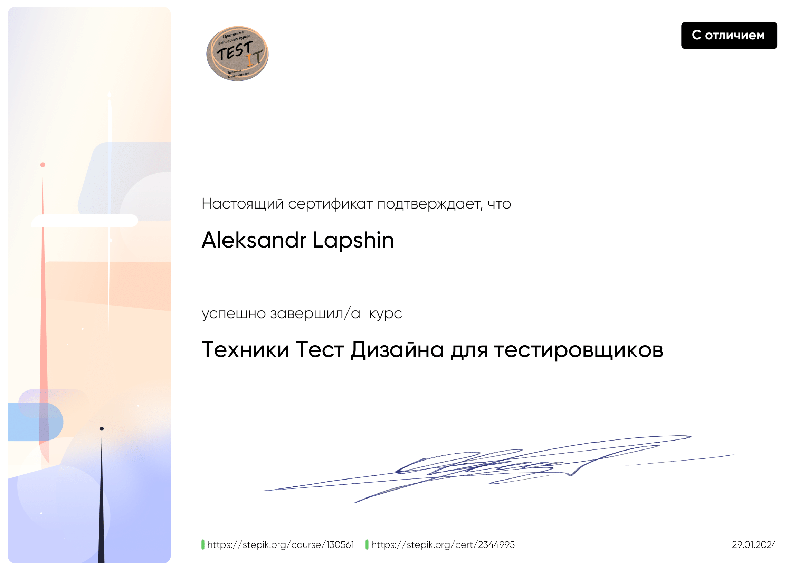
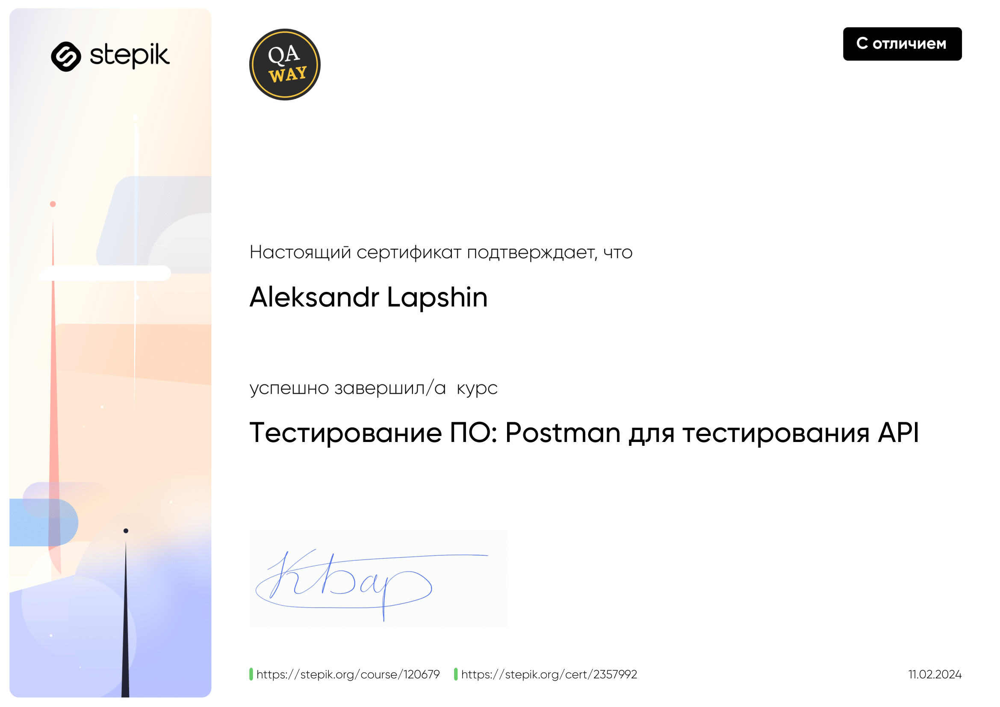
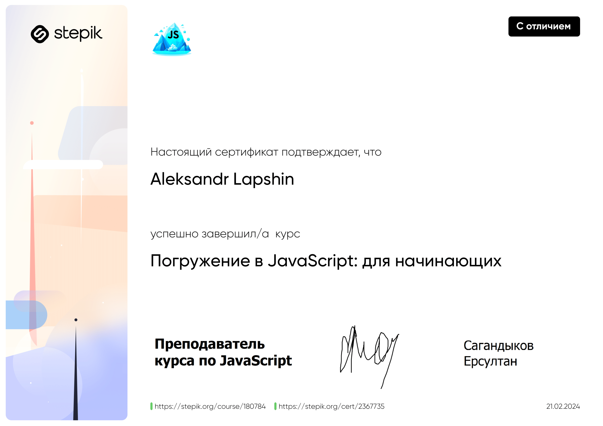
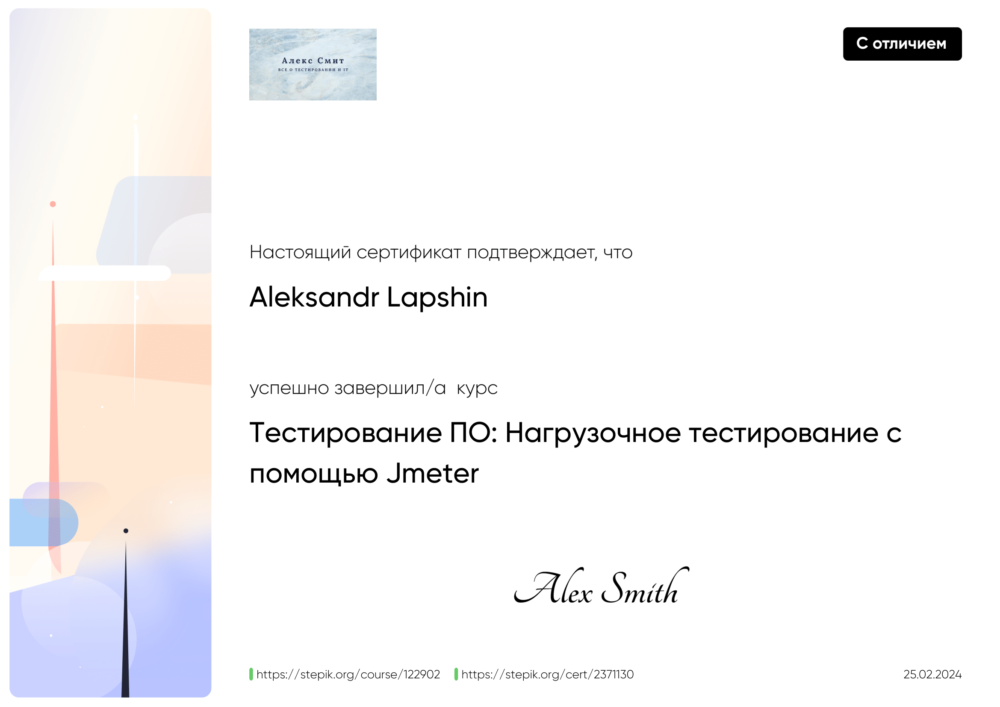
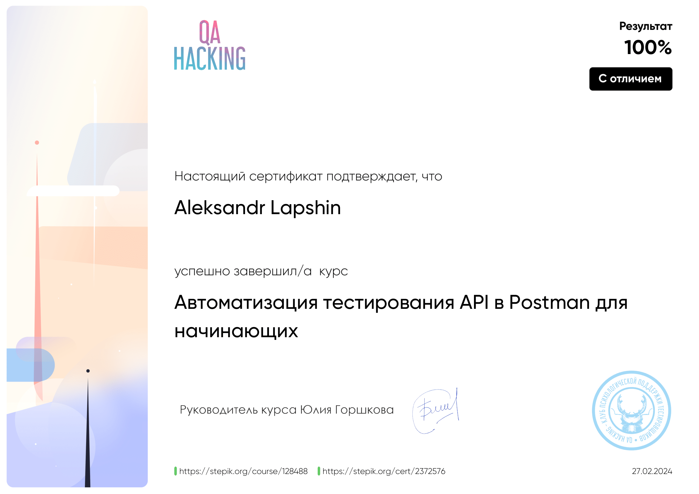
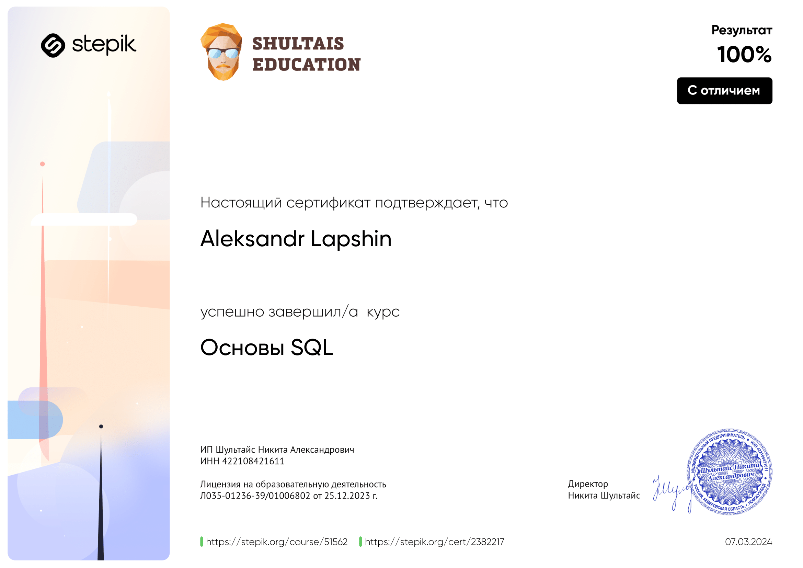
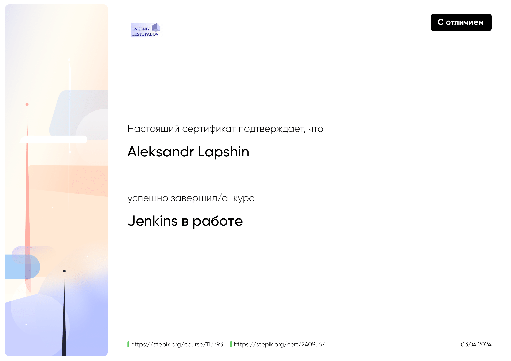
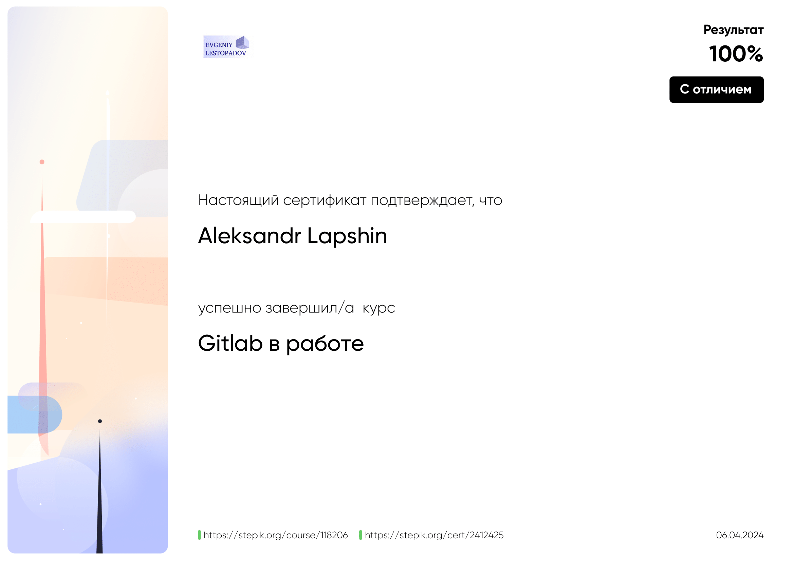
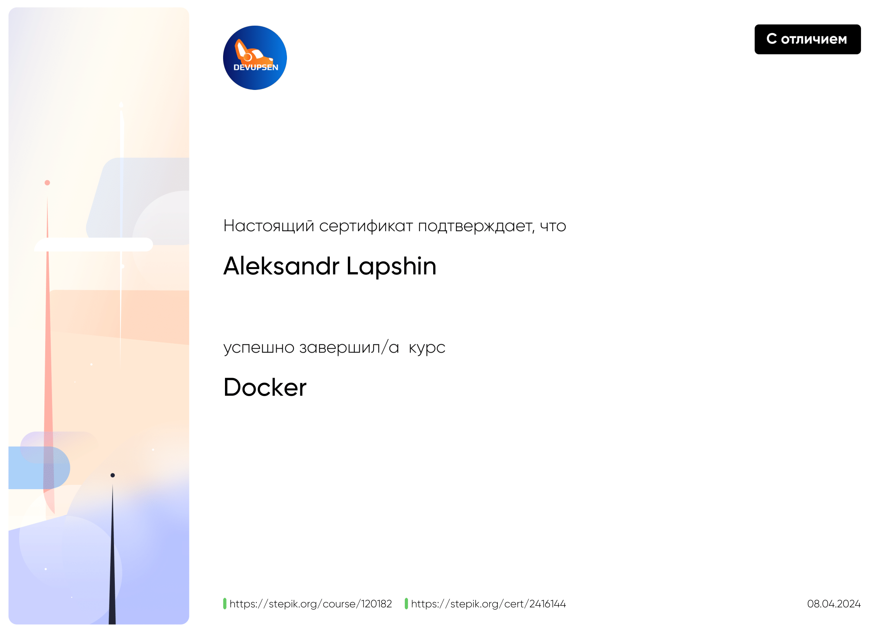

<table>
  <tr>
    <th colspan="2" style="text-align:center;"><h3>Техники Тест Дизайна для тестировщиков</h3></th>
  </tr>
  <tr>
    <td width="30%">
      
 Тест Дизайн
 Эквивалентные классы и граничные значения
 Таблица принятия решений
 Доменный анализ
 Тестирование переходов и состояний
 Попарное тестирование
 Тестирование вариантов использования

  </td>
    <td width="70%">
      
    </td>
  </tr>
  
  <tr>
    <th colspan="2" style="text-align:center;"><h3>Тестирование ПО: Postman для тестирования API</h3></th>
  </tr>
  <tr>
    <td width="30%">

 Работа с запросами и ответами в Postman
 Коллекции и переменные в Postman
 Скрипты для автоматизации тестирования в Postman
 Возможности скриптов в Postman

  </td>
    <td width="70%">
      
    </td>
  </tr>
  
  <tr>
    <th colspan="2" style="text-align:center;"><h3>Погружение в JavaScript: для начинающих</h3></th>
  </tr>
  <tr>
    <td width="30%">

 Основы JavaScript
 Условные конструкции
 Циклы
 Функции
 Объекты
 Работа с примитивами
 Массивы

  </td>
    <td width="70%">
      
    </td>
  </tr>
  
  <tr>
    <th colspan="2" style="text-align:center;"><h3>Тестирование ПО: Нагрузочное тестирование с помощью Jmeter</h3></th>
  </tr>
  <tr>
    <td width="30%">

 Assertion - проверка ответов в Jmeter
 Тестирование API с помощью Jmeter
 Jmeter PRO

  </td>
    <td width="70%">
      
    </td>
  </tr>
  
  <tr>
    <th colspan="2" style="text-align:center;"><h3>Автоматизация тестирования API в Postman для начинающих</h3></th>
  </tr>
  <tr>
    <td width="30%">

 Автоматизация API
 Нагрузочное тестирование
 Groovy

  </td>
    <td width="70%">
      
    </td>
  </tr>
  
  <tr>
    <th colspan="2" style="text-align:center;"><h3>Основы SQL</h3></th>
  </tr>
  <tr>
    <td width="30%">

 Простые SQL-запросы
 Добавление, изменение, удаление
 Создание таблиц
 Индексы
 Поиск текста
 Многотабличные запросы (JOIN, UNION)
 Вложенные запросы

  </td>
    <td width="70%">
      
    </td>
  </tr>
  
  <tr>
    <th colspan="2" style="text-align:center;"><h3>Jenkins в работе</h3></th>
  </tr>
  <tr>
    <td width="30%">

 Jenkins: Основы
 Jenkins Pipeline
 Groovy lang

  </td>
    <td width="70%">
      
    </td>
  </tr>

  <tr>
    <th colspan="2" style="text-align:center;"><h3>Gitlab в работе</h3></th>
  </tr>
  <tr>
    <td width="30%">

 Git & GitLab
 GitLab: CI/CD

  </td>
    <td width="70%">
      
    </td>
  </tr>

  <tr>
    <th colspan="2" style="text-align:center;"><h3>Docker</h3></th>
  </tr>
  <tr>
    <td width="30%">

 Работа с контейнерами
 Образы
 Docker compose

  </td>
    <td width="70%">
      
    </td>
  </tr>

  <tr>
    <th colspan="2" style="text-align:center;"><h3>Администратор Kubernetes [Junior]</h3></th>
  </tr>
  <tr>
    <td width="30%">

 Kubernetes локально с k3s
 Боевой кластер с kubespray
 Жизненный цикл сервиса
 Шаблонизация манифестов с Helm

  </td>
    <td width="70%">
      
    </td>
  </tr>
  
</table>
