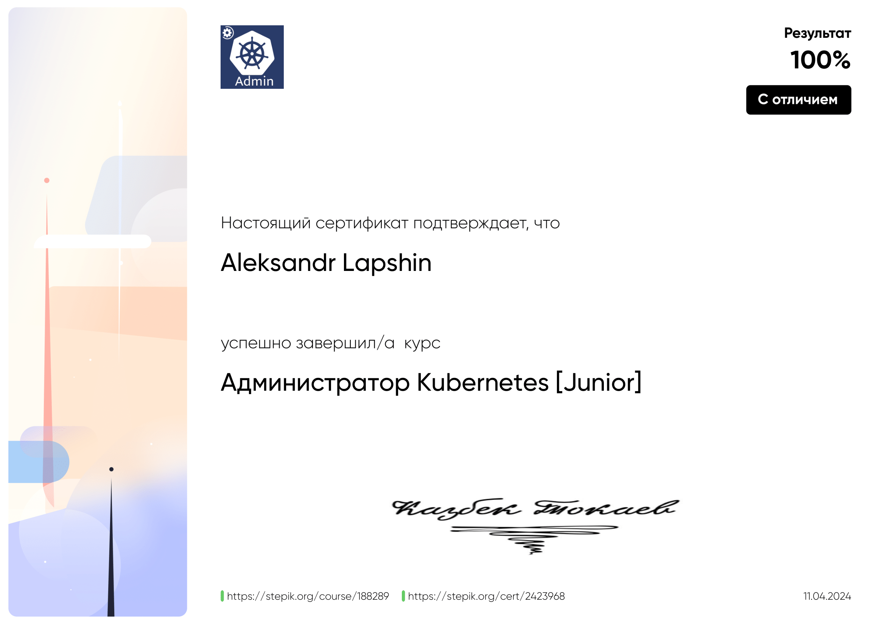

<table>
  <tr>
    <th colspan="2" style="text-align:center;"><h3>Техники Тест Дизайна для тестировщиков</h3></th>
  </tr>
  <tr>
    <td width="30%">
 Техники Тест Дизайна для тестировщиков

  </td>
    <td width="70%">
      
    </td>
  </tr>
  
  <tr>
    <th colspan="2" style="text-align:center;"><h3>Тестирование ПО: Postman для тестирования API</h3></th>
  </tr>
  <tr>
    <td width="30%">

 Тестирование ПО: Postman для тестирования API

  </td>
    <td width="70%">
      
    </td>
  </tr>
  
  <tr>
    <th colspan="2" style="text-align:center;"><h3>Погружение в JavaScript: для начинающих</h3></th>
  </tr>
  <tr>
    <td width="30%">

 Погружение в JavaScript: для начинающих

  </td>
    <td width="70%">
      
    </td>
  </tr>
  
  <tr>
    <th colspan="2" style="text-align:center;"><h3>Тестирование ПО: Нагрузочное тестирование с помощью Jmeter</h3></th>
  </tr>
  <tr>
    <td width="30%">

 Тестирование ПО: Нагрузочное тестирование с помощью Jmeter

  </td>
    <td width="70%">
      
    </td>
  </tr>
  
  <tr>
    <th colspan="2" style="text-align:center;"><h3>Автоматизация тестирования API в Postman для начинающих</h3></th>
  </tr>
  <tr>
    <td width="30%">

 Автоматизация тестирования API в Postman для начинающих

  </td>
    <td width="70%">
      
    </td>
  </tr>
  
  <tr>
    <th colspan="2" style="text-align:center;"><h3>Основы SQL</h3></th>
  </tr>
  <tr>
    <td width="30%">

 Основы SQL

  </td>
    <td width="70%">
      
    </td>
  </tr>
  
  <tr>
    <th colspan="2" style="text-align:center;"><h3>Jenkins в работе</h3></th>
  </tr>
  <tr>
    <td width="30%">

 Jenkins в работе

  </td>
    <td width="70%">
      
    </td>
  </tr>

   <tr>
    <th colspan="2" style="text-align:center;"><h3>Gitlab в работе</h3></th>
  </tr>
  <tr>
    <td width="30%">

 Gitlab в работе

  </td>
    <td width="70%">
      
    </td>
  </tr>

     <tr>
    <th colspan="2" style="text-align:center;"><h3>Docker</h3></th>
  </tr>
  <tr>
    <td width="30%">

 Docker

  </td>
    <td width="70%">
      
    </td>
  </tr>

     <tr>
    <th colspan="2" style="text-align:center;"><h3>Администратор Kubernetes [Junior]</h3></th>
  </tr>
  <tr>
    <td width="30%">

 Администратор Kubernetes [Junior]

  </td>
    <td width="70%">
      
    </td>
  </tr>
  
</table>
